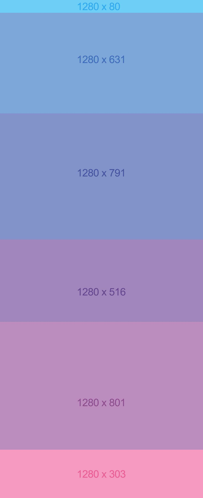
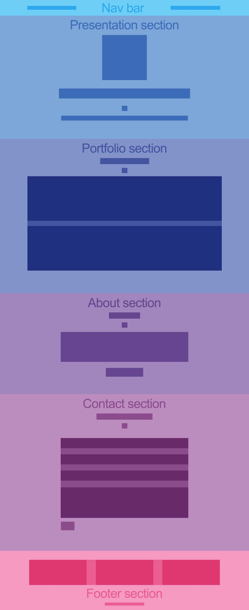

# Freelancer

Replicar el sitio Freelancer.

## Flujo de trabajo

1. Analizar que se requiere y reunir recursos necesarios (tipografías, íconos, videos, colores).

2. Enlazar esos recursos y en el caso de los colores, escribirlos como comentarios en css.

3. Examinar sitio y dividir en contenedores.

4. Aplicar esos contenedores en html y css, y nombrarlos con html semántico.

5. Ver página original y dividir en subcontenedores.

6. Aplicar esos subcontenedores en html y css.

7. Ajustar tamaños y posición de esos subcontenedores en css.

8. Vacíar contenido a subcontenedores en html.

9. Aplicar estilos en css.

FIN.
